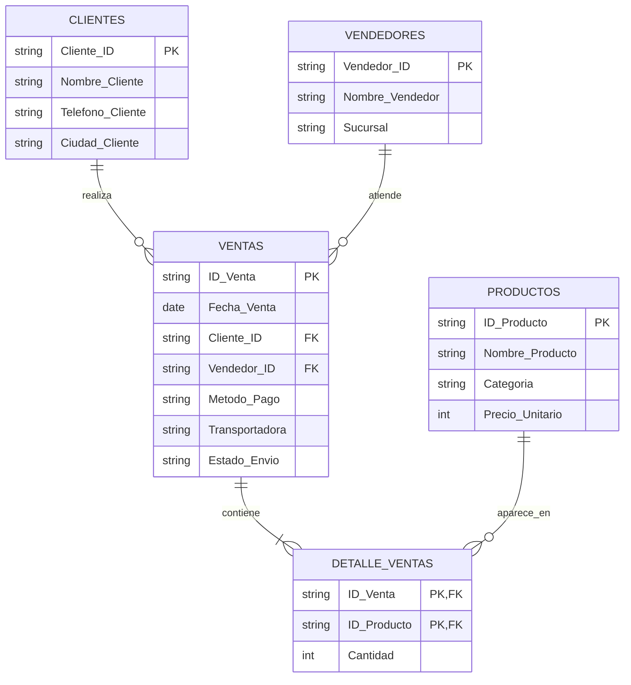

# Normalización de una Base de Datos de Ventas (1FN, 2FN y 3FN)
 
Este proyecto muestra, paso a paso, el proceso de **normalización** de una base de datos de ventas de una tienda de tecnología: se parte de una tabla plana con redundancia y grupos repetidos, y se llega a un modelo relacional en **Tercera Forma Normal (3FN)** con 5 tablas relacionadas por claves foráneas.
 
 
 
**Problemas de este diseño:**
 
- **Grupos repetidos:** las columnas Producto_1/2/3 repiten la misma estructura. Si una venta tuviera 4 productos, habría que agregar más columnas.
- **Redundancia:** el nombre, teléfono y ciudad del cliente se copian en cada venta; lo mismo con el vendedor y los precios de los productos.
- **Anomalías de actualización:** si un cliente cambia de teléfono, hay que corregirlo en muchas filas; si se olvida una, los datos quedan inconsistentes.
## Primera Forma Normal (1FN)
 
**Regla:** todos los valores deben ser atómicos y no puede haber grupos repetidos.
 
**Qué se hizo:** cada producto vendido pasa a ser una **fila independiente**. Las columnas Producto_1/2/3 se convierten en una sola columna `Producto` (con su `Categoria`, `Cantidad` y `Precio_Unitario`).
 
- 200 ventas × 3 productos = **600 filas**
- **Clave primaria compuesta:** (`ID_Venta`, `Producto`)
```
ID_Venta | Producto         | Fecha_Venta | Cliente_ID | Nombre_Cliente | ... | Cantidad | Precio_Unitario
VTA0001  | Teclado Redragon | 2026-02-02  | C002       | Ana Gómez      | ... | 1        | 150000
VTA0001  | Impresora HP     | 2026-02-02  | C002       | Ana Gómez      | ... | 1        | 650000
VTA0001  | Router TP-Link   | 2026-02-02  | C002       | Ana Gómez      | ... | 4        | 230000
```
 
**Problema que queda:** hay **dependencias parciales**. La fecha o el cliente dependen solo de `ID_Venta` (no del producto), y la categoría o el precio dependen solo del producto (no de la venta), pero la clave es compuesta.
 
## Segunda Forma Normal (2FN)
 
**Regla:** estar en 1FN y que todo atributo no clave dependa de la **clave completa**, no de una parte de ella.
 
**Qué se hizo:** se separan las dependencias parciales en tres tablas:
 
- **VENTAS** — atributos que dependen solo de `ID_Venta`: fecha, cliente, vendedor, método de pago, transportadora y estado del envío.
- **PRODUCTOS** — atributos que dependen solo del producto: nombre, categoría y precio unitario. Se asigna un `ID_Producto` (P001–P008).
- **DETALLE_VENTAS** — la `Cantidad`, único atributo que depende de la clave completa (`ID_Venta`, `ID_Producto`).
**Problema que queda:** en VENTAS hay **dependencias transitivas**: `Nombre_Cliente`, `Telefono_Cliente` y `Ciudad_Cliente` dependen de `Cliente_ID` (no directamente de `ID_Venta`); igual ocurre con `Nombre_Vendedor` y `Sucursal`, que dependen de `Vendedor_ID`.
 
## Tercera Forma Normal (3FN)
 
**Regla:** estar en 2FN y que ningún atributo no clave dependa de otro atributo no clave (sin dependencias transitivas).
 
**Qué se hizo:** se extraen las dependencias transitivas de VENTAS en dos tablas nuevas:
 
- **CLIENTES** (`Cliente_ID`, Nombre, Teléfono, Ciudad)
- **VENDEDORES** (`Vendedor_ID`, Nombre, Sucursal)
VENTAS conserva solo las claves foráneas `Cliente_ID` y `Vendedor_ID`.
 
### Modelo final: 5 tablas
 

 
## Resultado
 
| Forma normal | Qué elimina | Resultado |
|---|---|---|
| **1FN** | Grupos repetidos y valores no atómicos | 1 tabla de 600 filas, clave compuesta (ID_Venta, Producto) |
| **2FN** | Dependencias parciales de la clave compuesta | VENTAS + PRODUCTOS + DETALLE_VENTAS |
| **3FN** | Dependencias transitivas | + CLIENTES y VENDEDORES → **5 tablas** |
 
El modelo final no tiene redundancia: cada dato se guarda **una sola vez** y se referencia por clave foránea. Esto elimina las anomalías de inserción, actualización y borrado de la tabla original.
 
## Datos del ejemplo
 
- 200 ventas (VTA0001–VTA0200), cada una con 3 productos
- 5 clientes (Bogotá, Medellín, Cali, Barranquilla, Bucaramanga)
- 3 vendedores en 3 sucursales
- 8 productos (accesorios, oficina, redes, almacenamiento, tecnología y muebles)
---
 
*Trabajo académico de normalización de bases de datos — Juan David Castaneda.*
